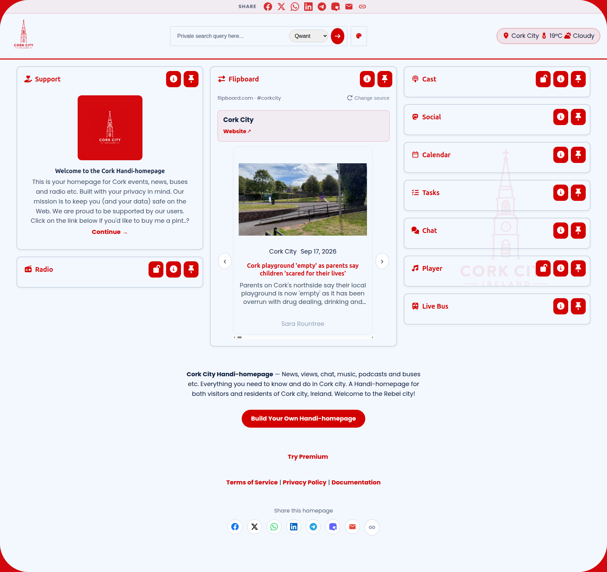

# Handi Homepage

**Your Safe First Page of the Web**



---

## Intro

Introducing a whole new way of surfing the Web. The Handi Homepage is simply a Social Homepage that keeps your data where it belongs. In your browser and your browser only. Create, config and share your own Handi-homepage with your family & friends.

Your data stays in your browser (local storage). Featuring zero trackers. Zero cookies. Zero surveillance. Say NO to surveillence capitalism and reclaim your data sovereignty all in one go.

## Video

▶️ **[Watch the Handi Homepage demo](https://handihomepage.com/wp-content/uploads/2026/07/handi_WEB.mp4)**

<video src="https://handihomepage.com/wp-content/uploads/2026/07/handi_WEB.mp4" controls poster="images/handi-cork-ss.png" style="max-width:100%;width:720px;"></video>

## How does it work?

Your data is divided into two types: public vs private. 

### Public Data:

Public data is built and stored client-side using our [handi-builder](https://handihomepage.com/handi-builder/) web tool. Choose your news feeds, local music tracks, podcasts, social media #hashtags or @users to follow on Mastodon etc. 

All this public data is stored in (and decorated from) a super-long link you create and share among friends, family and your community. So they can see what you see. Your link is private but can be shared by you on social media and your website - if you choose.

### Private Data:

For users who choose to enter their own data eg. for the Task List, Live Bus Routes, Local AI, approximate location (for weather) etc. This data is stored in your browser memory only. It does not reach our server.

In fact, you have to configure your Handi-homepage on each of your devices. There's no login. No registration. No tracking. You cannot sync your devices since we know absolutely nothing about you or your data.

## What makes Handi-homepage a *social* homepage?

The Handi-homepage is part feedreader, part social platform, part homepage. The homepage integrates with the Matrix chat servers so you can chat in totally privacy. 

It also integrates with the Mastodon social network where you can follow by content by #hashtag or #account. This means you can share info with others in your community or group. Even if they are not members of the Mastodon social network.

## The techie bit

Built on nodejs. We provide a layer of anonymity between you and the apparatus of surveillence captialism. By routing your feeds through at least one endpoint on our server, and keeping your data on your system only. 

We help you maintain your anonymity and privacy online. Our [handi-builder](https://handihomepage.com/handi-builder/) tool helps you build your own link / Handi-homepage. This tool functions client-side, so we cannot see what your Handi-homepage contains.

## Privacy Policy & Mission

Our goal is to help reclaim international tech sovereignty for countries and individuals. Our Tech. Our Data. Our Freedom.

For further info about our data privacy policy and our project mission. Check out our [Privacy Page](https://handihomepage.com/privacy/)

## Features

The interface contains *elements* on-screen for each module eg. a local AI element, a chat element, a live bus element etc. You pin elements and add or remove them using the '+' setting button in the footer of the page.

### Dashboard
- Drag-and-drop layout (Packery masonry grid)
- Pin modules to the top
- Light / dark themes toggle
- Additional themes: senior (high-contrast, elderly-friendly), student, techie, women
- Module lock buttons to prevent accidental changes
- Per-module info popups and settings
- Handi-pack support — deploy a branded dashboard from a shareable config URL
- Subscription-based premium modules (Stripe)
- Download and install as a PWA (installable webpage)

### Free modules

| Module | Description |
|---|---|
| 📸 Gallery | Photo slideshow with lightbox (or a Pixelfed feed) |
| 🎵 Player | Local audio player with visualiser |
| 📻 Radio | Internet radio with country filter |
| 📰 News | RSS feed reader |
| 🐘 Social | Mastodon feed (profile, hashtag or local timeline) |
| 📚 Flip | Flipboard profile/topic feeds |
| ✉️ Newsletter | Newsletter RSS feed as a card scroller |
| 🎙️ Cast | Podcast player |
| 💬 Chat | Matrix messaging |
| ⚽ Sports | Live football scores and key events |
| 🎪 Events | Festivals and things to do near you (Eventbrite) |

### Premium modules

| Module | Description |
|---|---|
| 📞 Phone | One-tap audio/video calling with contact photos |
| 🚌 Bus | Real-time Irish bus tracker (GTFS-RT) |
| 📅 Calendar | ICS calendar with reminders |
| ✅ Tasks | To-do list |
| 🧠 LLM | Private AI chat (client-side model) |
| ❤️ Support | Support link/card |
| 📍 Location | SMS emergency location sharing |

Premium modules are unlocked with a subscription (Stripe).

---

## Tech Stack

| Layer | Technology |
|---|---|
| **Frontend** | Vanilla JavaScript (ES modules) |
| **Build/dev** | Vite (HMR + dev proxy) |
| **Backend** | Node.js + Express |
| **Storage** | IndexedDB (client-side) |
| **Chat** | Matrix via `matrix-js-sdk` |
| **Calls** | Infobip RTC (WebRTC) |
| **SMS** | Infobip API |
| **Bus data** | NTA GTFS-RT (protobuf) |
| **Events** | Eventbrite API |
| **Payments** | Stripe subscriptions |

---

## Getting Started

### Prerequisites

- **Node.js** 22+ (required for Vite 8)
- npm

### Install

```bash
git clone https://codeberg.org/handi/ple.git
cd ple
cp .env.example .env      # edit in your API keys (never commit .env)
npm install
```

### Development

```bash
# Terminal 1 — Express API server (port 8080)
npm start

# Terminal 2 — Vite dev server with HMR (port 5173)
npm run dev
```

Vite proxies `/api/*` to the Express server. Open `http://localhost:5173`.

### Production

```bash
npm start                 # Express serves the app on port 8080
# or with PM2:
pm2 start server.js --name handi
```

---

## Environment Variables

Copy `.env.example` to `.env`. The `.env` file is gitignored — never commit real secrets.

| Variable | Required for | Description |
|---|---|---|
| `PORT` | — | Server port (default `8080`) |
| `BUS_API_KEY` | Bus | NTA GTFS-RT API key |
| `INFOBIP_API_KEY` | Phone / Location | Infobip SMS/RTC API key |
| `INFOBIP_BASE_URL` | Phone / Location | Infobip API host |
| `STRIPE_SECRET_KEY` | Premium | Stripe secret key |
| `VITE_MATRIX_PASS` | Chat (dev) | Matrix password (Vite-only) |
| `EVENTBRITE_PRIVATE_TOKEN` | Events | Eventbrite private OAuth token |
| `EVENTBRITE_PUBLIC_TOKEN` | Events | Eventbrite public token |
| `LOG_USERNAME` / `LOG_PASSWORD` | Logging | HTTP auth for the log endpoint |
| `LOG_LEVEL` / `LOG_MAX_BYTES` / `LOG_KEEP_BYTES` | Logging | Client event logging controls |
| `PROXY_USERNAME_*` / `PROXY_PASSWORD_*` | News feeds | Feed-relay proxy credentials |

---

## File Index

```
ple/
├── server.js                  # Express API server + static hosting
├── app.js                     # App entry
├── vite.config.js             # Vite dev server + /api proxy
├── package.json
├── .env.example               # Environment template (never commit .env)
├── index.html                 # Dashboard
├── settings.html              # Settings page
├── selector.html              # Module selector
├── upload.html                # Upload helper
├── subscription-success.html  # Stripe checkout success page
├── manifest.json              # Web app manifest
├── service-worker.js          # PWA service worker
├── .well-known/               # assetlinks.json (Android TWA verification)
├── .zed/                      # Editor settings
├── css/
│   ├── main.css               # Entry stylesheet
│   ├── layout.css             # Grid, responsive, module layouts
│   ├── theme.css              # Dark theme
│   ├── elderly.css            # High-contrast senior theme
│   ├── student.css            # Student theme
│   ├── techie.css             # Techie theme
│   ├── woman.css              # Woman theme
│   ├── settings.css           # Settings page styles
│   ├── site-pack.css          # Handi-pack styling
│   ├── webrtc-widget.css      # Calls widget
│   ├── fonts/                 # Self-hosted webfonts
│   └── vendor/                # Font Awesome
├── js/
│   ├── settings-app.js        # Settings page entry
│   ├── core/                  # Shared helpers (layout, module-registry,
│   │                          #   module-buttons, settings, storage, handi-pack,
│   │                          #   weather, theme-switcher, …)
│   └── vendor/                # Packery, Sortable, matrix-js-sdk, …
├── modules/                   # One folder per dashboard module
│   ├── gallery/  music/  cast/  radio/  news/  mastodon/  flip/  newsletter/
│   ├── sports/   events/  chat/                        # free modules
│   ├── friendly-phone/  bus/  calendar/  task/  ai/  support/  emergency/
│   └── weather/  ui/                                   # premium + shared UI
├── lang/                      # UI translations (en, ga, de, fr, es, it, nl, …)
├── manifests/                 # Extra web app manifests (cork, gaeilge)
├── images/                    # Icons, logos and screenshots
├── scripts/                   # Build/utility scripts
├── snippets/                  # Reusable HTML/CSS snippets
└── proto/                     # GTFS-Realtime protobuf definitions
```

---

## License

[GNU General Public License v3.0](LICENCE.txt) — see `LICENCE.txt` for the full text.
